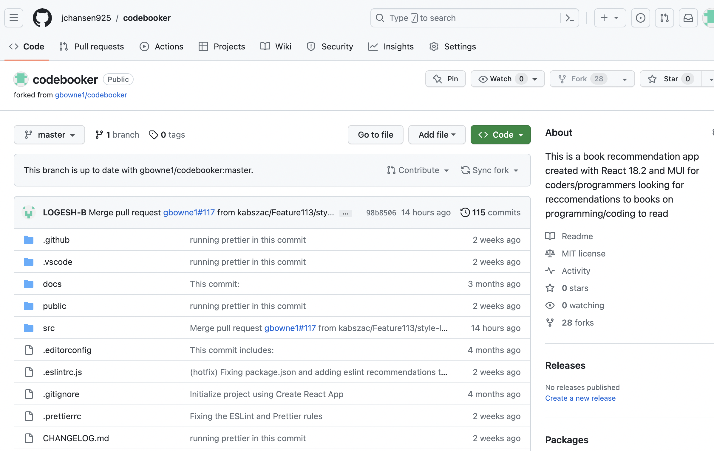

# Fork and Clone 

## Steps to fork the repo: 

1. Go to the main GitHub page of the repo:
    (https://github.com/gbowne1/codebooker/)
   
1. Once you are on the main GitHub page of the repo, click the **Fork** button at the top right of the page. 

    

1. You will now be on a page with the heading **Create a new fork**.

     Two fields are required, Owner and Repository name. Make sure the owner is you and the repository name is correct. These fields should already be populated when you click on this page in step 2.

    

2. Click on the green **Create fork** button on the lower right-hand corner of the page.

    

3. You will now have a forked version of the original repo that is up to date with the master branch of the original repo.

    


## Steps to clone the repo:


1. Open a terminal window and go to the location where you want your cloned repository to reside.

    #### Clone using HTTP:

    Clone this repo to your local machine using
    ```git clone https://github.com/gbowne1/codebooker.git```.

    #### Clone using SSH:

    Clone this repo to your local machine using
    ```git clone git@github.com:gbowne1/codebooker.git```.

Once you have successfully cloned the repository, a new sub-directory will appear in the location where you ran the clone repository commands. This new sub-directory will have the same name as the original repository that was cloned.
 
1. Create your feature branch using ```git checkout -b my-feature```.

1. After you've made your changes to the code, commit your changes using ```git commit -m 'feat: My new feature'```.

1. Push to the branch using ```git push origin my-feature```.

1. Create a new [pull request] (SubmitPR.md).
    After your pull request is merged, you can delete your feature branch.

